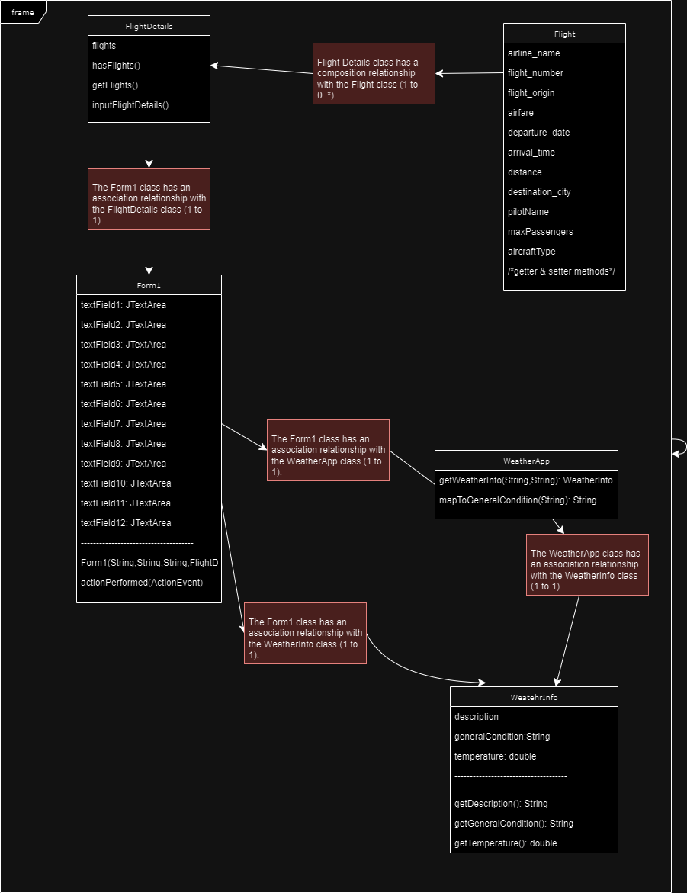

# Airline Manager

Airline Manager is a Java-based application that allows users to manage flight details and retrieve weather information for a specified city. The application provides a graphical user interface (GUI) built using Swing components, making it easy to interact with and display flight and weather data.

## Features

- Input and store flight details, including airline name, flight number, origin, destination, airfare, departure time, arrival time, distance, aircraft type, pilot name, and maximum passengers.
- Display sorted flight details based on flight number in ascending order.
- Retrieve and display weather information for a specified city using the OpenWeatherMap API.
- User-friendly GUI for easy interaction and data display.

## Prerequisites

- Java Development Kit (JDK) 8 or higher
- org.json library (external library)

## Project Structure

The project consists of the following Java files:

- `FlightDetails.java`: Handles the input and storage of flight details.
- `Flight.java`: Represents a single flight with its attributes and getter/setter methods.
- `WeatherInfo.java`: Represents the weather information retrieved from the API.
- `WeatherApp.java`: Handles the retrieval of weather information from the OpenWeatherMap API.
- `Form1.java`: Implements the GUI using Swing components and integrates flight and weather data.

## Setup and Execution

1. Ensure that you have Java Development Kit (JDK) 8 or higher installed on your system.

2. Download the org.json library and add it to your project's classpath:
   - Either Use the provided .jar file or Download the org.json JAR file from the official website or a reliable source.
   - In your IDE, right-click on the project and select "Properties" or "Settings".
   - Navigate to the "Libraries" or "Dependencies" section.
   - Add the org.json JAR file to the project's classpath.

3. Clone or download the project source code to your local machine.

4. Open the project in your preferred Java IDE.

5. Navigate to the `Form1.java` file and run it to start the GUI execution.

6. Follow the prompts in the GUI to input flight details and retrieve weather information for a desired city.

## API Key

To retrieve weather information, you need to obtain an API key from OpenWeatherMap. Follow these steps:

1. Visit the OpenWeatherMap website (https://openweathermap.org) and sign up for a free account.
2. After signing in, navigate to the API section and obtain your API key.
3. In the `Form1.java` file, replace the placeholder `"YOUR_API_KEY"` with your actual API key.

## Acknowledgments

- OpenWeatherMap for providing the weather data API.
- The creators and maintainers of the org.json library for simplifying JSON parsing in Java.

## UML Diagram

The UML diagram below represents the structure and relationships of the classes in the Airline Manager project.

## License

This project is open-source and available under the [MIT License](https://opensource.org/licenses/MIT).

Feel free to contribute, provide feedback, or report any issues you encounter while using the Airline Manager application.